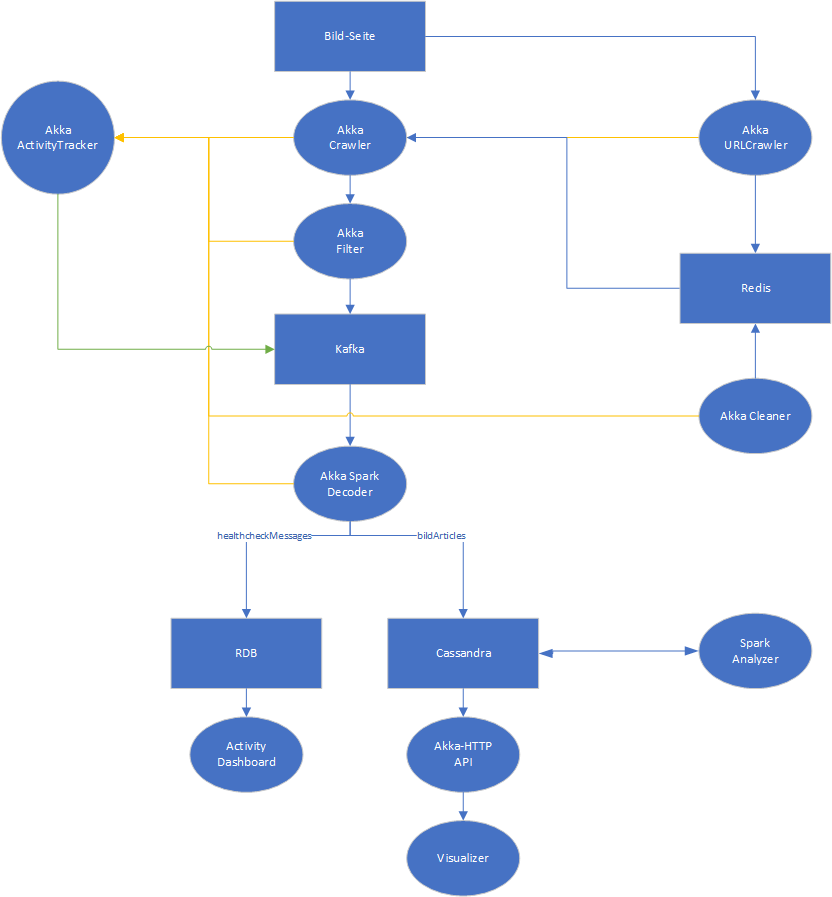
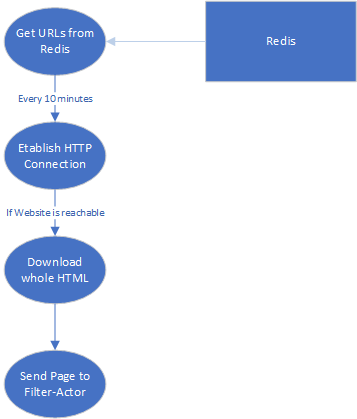
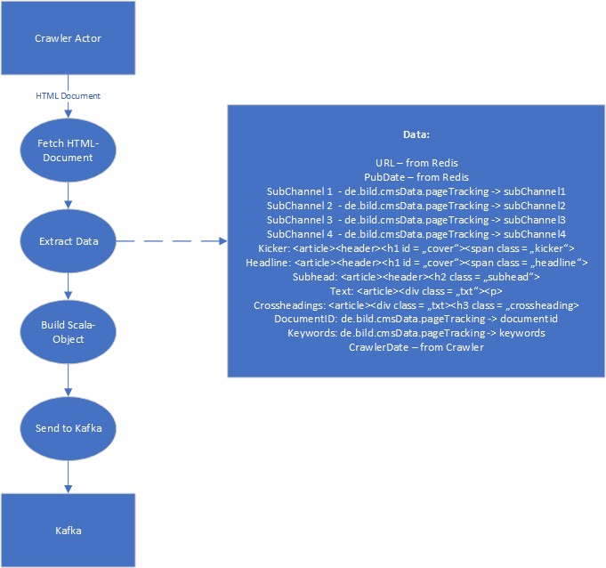
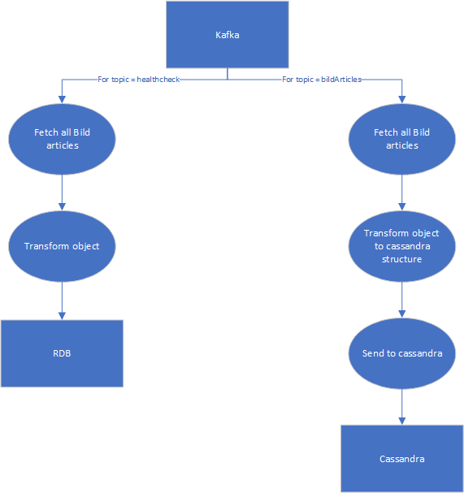

# Project Modules

## urlcrawler
Is searching for new URLs on the Bild Website.

## crawler
Downloads the articles.

## filter
Checks if the articles from the crawler are bild-articles.

## decoder
Checks the section of the article and decode it in scala-objects.

## cleaner
Checks the cassandra url list for duplicates and remove them.

## analyzer
Analyze the given information about the articles.

## api
An interface for users.

## visualizer
Visualization of analyzed information about Bild articles.